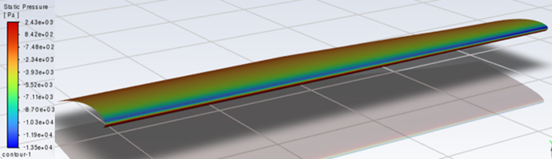
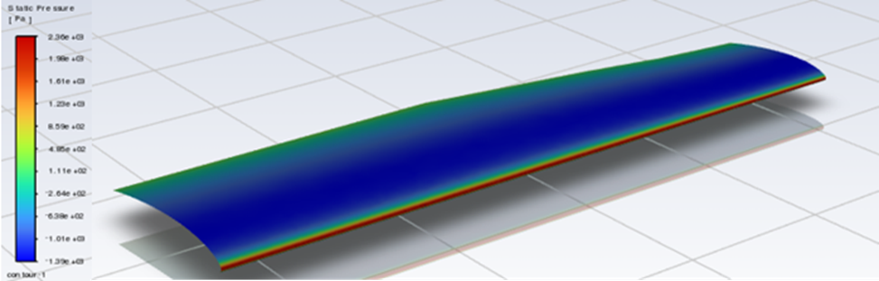
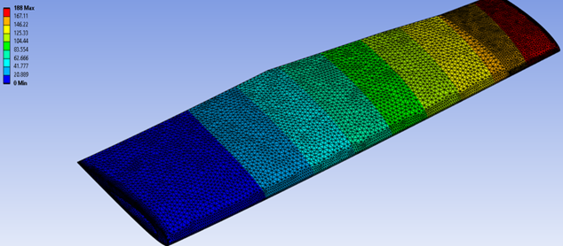
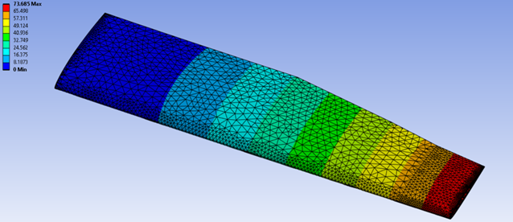
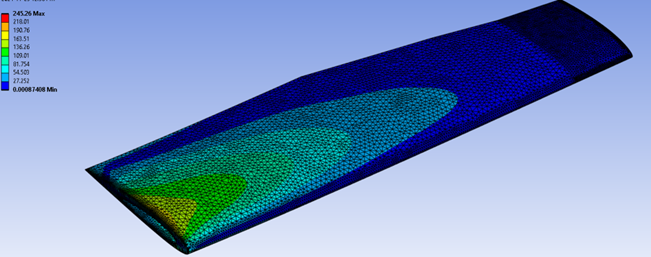
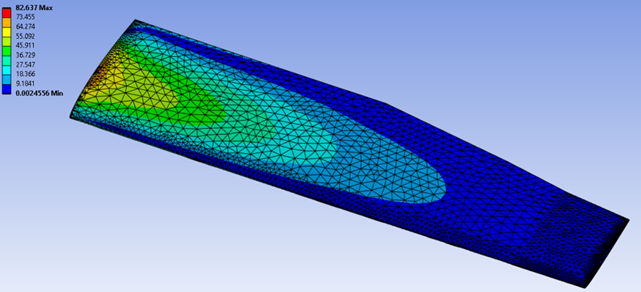

# 🛠️ Finite Element Analysis of a Cessna 172 Wing

This project involved a comprehensive structural analysis of a simplified Cessna 172 wing under realistic aerodynamic conditions using Finite Element Analysis (FEA) and Computational Fluid Dynamics (CFD).

---

### 🎯 Objective
Evaluate the wing's structural behavior under various flight conditions — including deformation, stress distribution, and vibration — to support aeroelastic performance evaluation.

---

### ⚙️ Tools & Methods
- **CAD**: Modeled a simplified wing excluding internal components and control surfaces.
- **CFD**: Used 2D steady-state simulations to estimate aerodynamic forces during climb and cruise.
- **FEA**: ANSYS Workbench was used for:
  - Linear static structural analysis
  - Modal analysis to evaluate natural frequencies and mode shapes
- **Mesh Convergence Study**: Conducted to ensure solution stability and accuracy.

---

### 📊 Key Results
- Max deformation occurred near the wingtip under climb conditions.
- Stress concentration zones were identified near the wing root and spar connections.
- First few natural frequencies were extracted, with mode shapes showing expected bending and torsion patterns.

---

### 🖼️ Visual Results

#### Pressure Contour
**Climb Attitude:**

**Cruise Attitude:**

#### Total Deformation
**Climb Attitude:**

**Cruise Attitude:**

#### Von-Mises Stress
**Climb Attitude:**

**Cruise Attitude:**

---

### 📎 Deliverables
- [PDF Report](../assets/pdfs/cessna172-analysis.pdf) *(Upload this*
